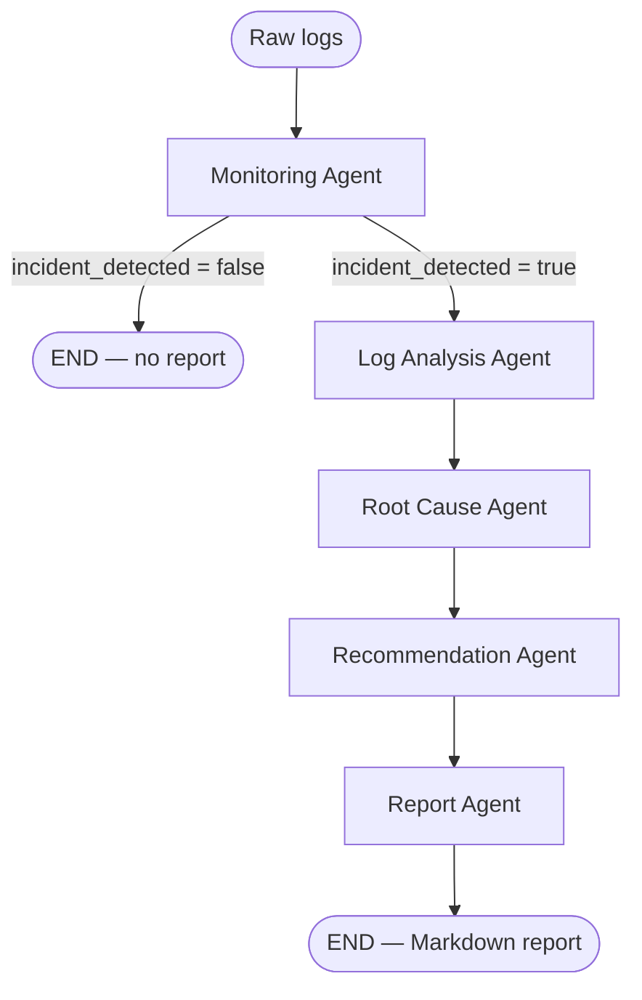

# Feature 5: LangGraph Multi-Agent Orchestrator

## What was built

A LangGraph `StateGraph` coordinating five agents over raw application log text, exposed via `POST /api/v1/investigations`:

1. **Monitoring Agent** — decides whether the logs indicate an active incident at all.
2. **Log Analysis Agent** — extracts structured findings (key errors, affected components, time range, patterns).
3. **Root Cause Agent** — hypothesizes why the incident happened.
4. **Recommendation Agent** — suggests immediate and long-term fixes.
5. **Report Agent** — synthesizes everything into a Markdown incident report.

Plus the infrastructure the agents run on:
- **`LLMProvider`** — a one-method `Protocol` (`infrastructure/llm/provider.py`) with `AnthropicProvider` and `GeminiProvider` implementations and a cached factory selecting between them via `Settings.llm_provider`.
- **`InvestigationState`** — the Pydantic model threaded through the graph (`agents/state/investigation_state.py`).
- **`investigation_service.run_investigation()`** — the application-layer entry point the API router calls.

## The workflow



1. **Monitoring Agent** reads the raw logs and asks: *is there an incident here at all?* It returns `incident_detected` (bool) and a one-line `monitoring_summary`. This is the only conditional branch point in the graph.
2. **If no incident is detected, the graph stops immediately.** The other four agents — each an LLM call — never run. This isn't a stylistic choice: it's a real cost/latency optimization and the one place LangGraph's conditional-edge routing actually matters here, rather than just chaining five steps in a fixed line.
3. **Log Analysis Agent** runs only once an incident is confirmed. It re-reads the logs (now with the monitoring summary as context) and extracts structured findings: which errors, which components, over what time range, what pattern.
4. **Root Cause Agent** takes only the *structured* log analysis (not the raw logs again) and hypothesizes a root cause with a confidence level and contributing factors.
5. **Recommendation Agent** takes the root cause and proposes concrete immediate actions and long-term fixes.
6. **Report Agent** takes everything produced so far (monitoring summary, log analysis, root cause, recommendations) and writes the final Markdown incident report — the one agent whose output is prose for a human, not JSON for the next step.

Each agent only sees what it needs, not the entire state blob — Root Cause doesn't need the raw logs again, Report doesn't need to re-derive anything, it just synthesizes. This keeps prompts focused and keeps each agent's contract (what it reads, what it writes) explicit and testable in isolation.

## How it's wired (the LangGraph mechanics)

- **State**: `InvestigationState` (Pydantic). Each node returns a `dict` of only the fields it owns; LangGraph merges it into the running state. No two agents write the same field.
- **Dependency injection into nodes**: LangGraph nodes only receive `state`. To get an `LLMProvider` into each node anyway, every agent module exports a *factory* — `make_monitoring_agent(llm) -> node_fn` — and `build_investigation_graph(llm)` is what actually takes the dependency, calling each factory once at graph-construction time.
- **Structured output**: the first four agents are prompted to return *only* JSON matching a specific schema (see `agents/prompts/investigation_prompts.py`), parsed into the matching Pydantic model. A non-compliant response raises `AgentOutputError` rather than being silently accepted or crashing with an unclear `KeyError` deep in a node.
- **Fail-fast configuration**: if the selected provider's API key isn't set, `LLMConfigurationError` is raised the moment the provider is constructed (not on first use), and mapped to HTTP `503` by a FastAPI exception handler in `main.py`.

## How to run it

Requires an LLM API key — copy `backend/.env.example` to `backend/.env` and set `ANTHROPIC_API_KEY` (default provider) or `GEMINI_API_KEY` + `LLM_PROVIDER=gemini`.

```bash
cd backend
uv sync
uv run uvicorn app.main:app --app-dir src --reload
```

```bash
curl -X POST http://localhost:8000/api/v1/investigations \
  -H "Content-Type: application/json" \
  -d '{"logs": "2026-07-31T10:02:11Z ERROR checkout-service: 500 Internal Server Error, connection to payments-db timed out (attempt 3/3)"}'
```

## How to test it

```bash
cd backend
uv run pytest -v
uv run ruff check .
```

## Verification performed

- `uv run pytest -v` — 6/6 passing:
  - Graph short-circuits correctly when Monitoring finds no incident (only 1 LLM call made, all downstream fields `None`).
  - Full 5-agent pipeline runs correctly and produces the expected final state when Monitoring finds an incident (5 LLM calls made, in order).
  - `AgentOutputError` is raised (not swallowed) when an agent's response isn't valid JSON.
  - The real HTTP endpoint (`POST /api/v1/investigations`) returns the correct response with the LLM dependency overridden to a fake.
  - Request validation (`logs` must be non-empty) returns `422` when the LLM dependency is healthy — isolated from the separate "not configured" failure mode.
- `uv run ruff check .` — clean.
- **Live smoke test without an API key configured** (the honest state of this environment — no Anthropic/Gemini key is available here): `POST /api/v1/investigations` correctly returned `503` with `{"detail": "LLM_PROVIDER is 'anthropic' but ANTHROPIC_API_KEY is not set."}` — confirming the fail-fast path works, rather than an unhandled exception or a misleading success.
- **Not verified**: an actual live call to Claude or Gemini. Neither provider adapter's real network path has been exercised — there's no API key configured in this environment. The interface contract and all orchestration logic are verified via `FakeLLMProvider`; the adapters themselves (`AnthropicProvider`, `GeminiProvider`) should be validated against a real key before relying on them.

## Decisions worth calling out

- **Stateless, no persistence** — the endpoint takes logs in the request body and returns the result; it doesn't read from or write to the database. Wiring this to persisted log/incident records is Feature 2 (log upload & storage), not yet built.
- **Structured JSON for 4 agents, Markdown for the last one** — matches what each output is *for*: machine-to-machine handoff vs. a human-facing deliverable.
- **Agent factories, not agent classes** — kept the DI story simple (closures over `llm`) rather than introducing a class hierarchy or a separate DI container for five small functions.

## What's next

Per the original roadmap: log upload & storage (to give this pipeline real, persisted logs instead of ad-hoc request bodies), Agent Skills (reusable tool-calling capabilities — still empty), MCP integration, guardrails, and evaluation (DeepEval).
